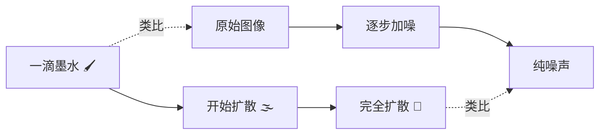

# 从一碗墨水说起

> **一句话总结**：扩散模型的核心思想——先把一张图逐渐破坏成纯噪声，然后学一个反向过程，从噪声中把图变回来。

## 直觉类比：墨水与水

想象你在一碗清水里滴入一滴墨水：

- **刚开始**：墨水还是一个小黑点，能看清它原本的形状
- **过了一会儿**：墨水慢慢扩散，边界变得模糊
- **最终**：墨水完全均匀地分散在水中，整碗水变成淡淡的灰色



扩散模型做的事就是**把上面这个过程反过来**——从一碗灰色的水（纯噪声）中，逆向找回那滴墨水的原始形状（生成图像）。

## 两个过程

一个扩散模型由两个过程组成：

### 1. 前向过程（Forward Process）— 你"看"得见的过程

> **大白话**：拿一张图，每一步加一点点噪声，加很多步后变成纯噪声。

这个过程是**固定的，不需要学习**。就像一个退化过程：原始图 $x_0$ → 加一点噪声得到 $x_1$ → 再加一点得到 $x_2$ → ... → $x_T$（纯噪声）。

### 2. 反向过程（Reverse Process）— 你"学"来的过程

> **大白话**：拿纯噪声，训练一个神经网络，让它一步步去掉噪声，最终恢复出一张清晰的图。

这个过程是**需要学习的**。网络的任务是：给定当前噪声图 $x_t$ 和时间步 $t$，预测出在当前步加入的噪声长什么样，然后去掉它。

## 为什么叫"扩散模型"？

"扩散"（Diffusion）这个词来自热力学中的扩散现象：

- 一滴墨水滴入水中，墨水分子会**从高浓度区域向低浓度区域扩散**
- 最终达到一个**均匀分布**的状态（熵最大）
- 这个过程是**不可逆**的

扩散模型的灵感就来源于此：
- 前向过程：把数据分布（有结构的图像）逐渐变成噪声分布（均匀混乱）
- 反向过程：学一个"逆扩散"，从噪声中恢复结构

## 整件事的鸟瞰图

```
                    前向过程（固定，不加学习）
                 +─────────────────────────────+
                 │  x₀ → x₁ → x₂ → ... → x_T  │
                 │  清晰          完全噪声      │
                 +─────────────────────────────+
                       │              │
                       │              │
                 ┌─────┘              └─────┐
                 │                           │
           我们要学习这个方向             这个方向是已知的
                 │                           │
                 └─────┐              ┌─────┘
                       │              │
                 +─────────────────────────────+
                 │  x₀ ← x₁ ← x₂ ← ... ← x_T  │
                 │  神经网络一步步去噪           │
                 +─────────────────────────────+
                    反向过程（需要学习）
```

简单来说：

1. 取一张训练图像 $x_0$
2. 对它做 $T$ 步加噪，得到 $x_T$（纯噪声）
3. 训练一个神经网络，让它学会从 $x_t$ 预测出噪声
4. 训练完了之后，从纯噪声 $x_T$ 开始，让网络一步步去掉噪声，就能生成新图像

## 要点回顾

1. 扩散模型有两个过程：**前向**（加噪，固定的）和**反向**（去噪，要学的）
2. 前向过程把数据变成噪声，反向过程从噪声中生成数据
3. 训练的**目标**是让网络学会预测当前步加入了什么噪声
4. 生成的**过程**是从纯噪声开始，一步步去噪

---

**继续阅读**：[[02_前向过程_加噪]] — 详细看看前向过程是怎么一步步加噪的
