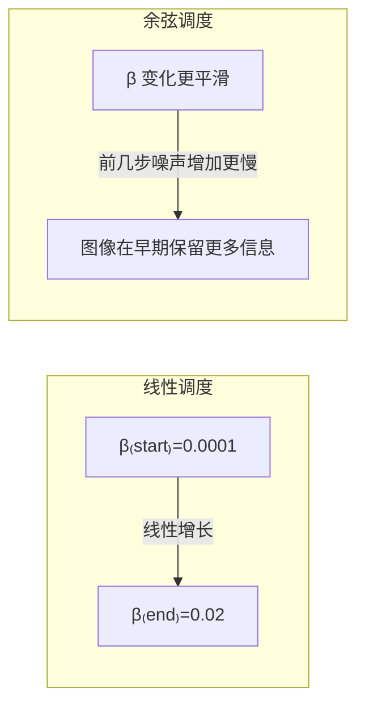

# 前向过程：加噪

> **一句话总结**：前向过程就是拿一张干净图，分 T 步往上面加高斯噪声，直到变成纯噪声。这个过程的数学形式是固定的——你不需要学，只要算。

## 直觉理解

想象你在调一杯鸡尾酒：

- 第 0 步：纯蓝色液体（原始图像 $x_0$）
- 第 1 步：滴入一滴透明液体（一点点噪声）
- 第 2 步：再滴入一滴
- ...
- 第 T 步：完全变成透明液体（纯噪声 $x_T$）

每一步加的"透明液体"的量，由一个参数 $\beta_t$ 控制。

## 前向过程的数学形式

### 单步加噪公式

给定当前步的图像 $x_{t-1}$，下一步 $x_t$ 从以下高斯分布中采样：

$$q(x_t | x_{t-1}) = \mathcal{N}(x_t; \sqrt{1-\beta_t} \cdot x_{t-1}, \beta_t \cdot \mathbf{I})$$

> **大白话**：第 $t$ 步的图 = (稍微缩小的上一步图像) + (一点高斯噪声)
>
> - $\sqrt{1-\beta_t}$ 表示保留上一步多少内容
> - $\beta_t$ 表示加多少噪声
> - 这两者加起来是 1（能量守恒）

### 重要性质：一步到位

前向过程有一个非常方便的性质——**你可以直接从 $x_0$ 跳到任意 $x_t$**，不需要一步步走：

$$x_t = \sqrt{\bar\alpha_t} \cdot x_0 + \sqrt{1-\bar\alpha_t} \cdot \epsilon$$

其中：
- $\bar\alpha_t = \prod_{i=1}^t (1-\beta_i)$ — 到第 $t$ 步为止，原始图像还剩多少
- $\epsilon \sim \mathcal{N}(0, \mathbf{I})$ — 高斯噪声
- $x_0$ — 原始图像

> **大白话**：$x_t$ = (原始图缩水到 $\sqrt{\bar\alpha_t}$ 倍) + (噪声放大到 $\sqrt{1-\bar\alpha_t}$ 倍)

这个性质非常有用，训练时我们不需要一步步算，直接一步到位。

### 不同时刻的图像

下图展示了从一张数字"8"开始，不断加噪声的过程：

![[../images/forward_process_illustration.png]]

可以看到：
- $t=0$：清晰可见的 8
- $t=100$：还能看出轮廓，但多了许多雪花点
- $t=300$：已经只能隐约看出两个圆圈
- $t=500$：几乎完全被噪声淹没
- $t=700-999$：完全变成纯噪声，没有任何结构信息了

## 噪声调度（Noise Schedule）

$\beta_t$ 怎么取？不同的取法就是不同的"噪声调度"：

### 线性调度（Linear Schedule）

DDPM 原版用的调度：
$$\beta_t = \beta_{\text{start}} + \frac{t}{T}(\beta_{\text{end}} - \beta_{\text{start}})$$

从很小的值（比如 $10^{-4}$）均匀增加到较大的值（比如 $0.02$）。

### 余弦调度（Cosine Schedule）

Improved DDPM 提出的改进版本，$\beta_t$ 增长更平滑：

$$\bar\alpha_t = \frac{f(t)}{f(0)}, \quad f(t) = \cos^2\left(\frac{t/T + s}{1+s} \cdot \frac{\pi}{2}\right)$$

## 两个重要的系数

$$\alpha_t = 1 - \beta_t$$

这是第 $t$ 步的"信号保留系数"。而累积的保留系数：

$$\bar\alpha_t = \prod_{i=1}^t \alpha_i$$

> **大白话**：$\bar\alpha_t$ 代表"到第 $t$ 步为止，原始图像还剩多少"。在 $t=0$ 时 $\bar\alpha_0 = 1$（什么都没丢），在 $t=T$ 时 $\bar\alpha_T \approx 0$（什么都丢了）。

## 要点回顾

1. 前向过程是**固定的**，不需要学习
2. 单步公式：$x_t = \sqrt{1-\beta_t} \cdot x_{t-1} + \beta_t$ 的噪声
3. **跳跃公式**（关键）：$x_t = \sqrt{\bar\alpha_t} \cdot x_0 + \sqrt{1-\bar\alpha_t} \cdot \epsilon$
4. $\bar\alpha_t$ 控制原始信息保留多少，从 1 下降到接近 0
5. 噪声调度有**线性**和**余弦**两种常见选择

---

**继续阅读**：[[03_反向过程_去噪]] — 前向过程的反向操作
