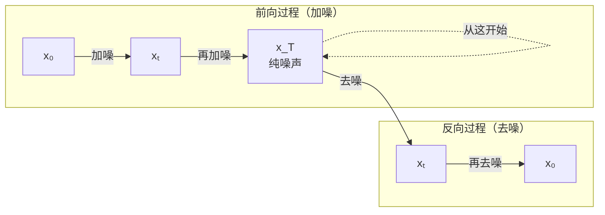

# 反向过程：去噪

> **一句话总结**：反向过程是扩散模型的核心——从纯噪声 $x_T$ 开始，训练一个神经网络一步步预测并去掉噪声，最终得到一张全新图像。

## 直觉理解

还记得前向过程吗？它把一张图慢慢变成噪声。反向过程就是它的逆操作：

> 你有一张被噪声覆盖的图，想恢复出原图——但这次不是在原图上恢复到干净版本（那是去噪），而是**从纯噪声出发，生成一张从未存在过的新图**。



## 反向过程的数学形式

### 和"后验概率"的关系

反向过程实际上是想学习**后验概率分布**：

$$q(x_{t-1} | x_t, x_0)$$

> **大白话**：已知当前噪声图 $x_t$ 和原始图 $x_0$，问 $x_{t-1}$ 是这样的概率有多大？

好消息是，如果已知 $x_0$，这个后验分布其实有**解析解**（可以用公式直接算出来）：

$$q(x_{t-1} | x_t, x_0) = \mathcal{N}(x_{t-1}; \tilde\mu_t(x_t, x_0), \tilde\beta_t \mathbf{I})$$

其中均值和方差分别是：

$$\tilde\mu_t = \frac{\sqrt{\alpha_t}(1-\bar\alpha_{t-1})}{1-\bar\alpha_t} x_t + \frac{\sqrt{\bar\alpha_{t-1}}\beta_t}{1-\bar\alpha_t} x_0$$

$$\tilde\beta_t = \frac{(1-\bar\alpha_{t-1})}{1-\bar\alpha_t}\beta_t$$

> **大白话**：如果能知道原始图像 $x_0$，那 $x_{t-1}$ 的分布是可以用公式精确算出来的。但问题是我们**没有** $x_0$（$x_0$ 正是我们想生成的）。

### 神经网络要学什么

因为我们没有 $x_0$，所以要用神经网络来**近似**这个后验分布：

$$p_\theta(x_{t-1} | x_t) = \mathcal{N}(x_{t-1}; \mu_\theta(x_t, t), \Sigma_\theta(x_t, t))$$

> **大白话**：让神经网络 $\theta$ 来猜 $x_{t-1}$ 应该是多少。

网络输入：当前噪声图 $x_t$ 和时间步 $t$
网络输出：$x_{t-1}$ 的均值 $\mu_\theta$（方差可以固定也可以学习）

### 关键变体：预测噪声而不是预测图像

DDPM 中做了一个巧妙的转化——不直接预测 $x_{t-1}$ 的均值，而是**预测当前步的噪声 $\epsilon$**：

$$\mu_\theta(x_t, t) = \frac{1}{\sqrt{\alpha_t}} \left(x_t - \frac{\beta_t}{\sqrt{1-\bar\alpha_t}} \epsilon_\theta(x_t, t)\right)$$

> **大白话**：神经网络 $\epsilon_\theta$ 输入 $x_t$ 和 $t$，输出它认为当前图中包含的噪声 $\epsilon$。然后用公式算出 $x_{t-1}$ 的均值。

为什么预测噪声更好？因为**预测噪声的损失函数更简单**（MSE 损失），而且预测噪声等价于预测 $x_0$，但噪声的数值范围更稳定（$\mathcal{N}(0, 1)$）。

## 采样（Sampling）过程

训练好之后，生成新图像的流程如下：

```
1. 从纯噪声开始：x_T ~ N(0, I)
2. for t = T, T-1, ..., 1:
     a. 用神经网络预测噪声：ε = ε_θ(x_t, t)
     b. 用公式计算 x_{t-1} 的均值
     c. 如果 t > 1，加一点随机噪声
     d. 得到 x_{t-1}
3. 返回 x_0
```

## 对比：前向 vs 反向

| | 前向过程 | 反向过程 |
|---|---|---|
| 方向 | 干净 → 噪声 | 噪声 → 干净 |
| 是否要学 | ❌ 不需要（公式固定） | ✅ 需要训练神经网络 |
| 具体操作 | 加高斯噪声 | 预测噪声并减去 |
| 步数 | T 步（一般 1000） | T 步（同前向） |

## 要点回顾

1. 反向过程用神经网络**预测噪声**，而不是直接预测图像
2. 网络输入是 $x_t$ 和 $t$，输出是预测的噪声 $\epsilon_\theta(x_t, t)$
3. 用预测的噪声通过公式可以计算出 $x_{t-1}$ 的均值
4. 采样时从纯噪声出发，**逐步去噪**，最后得到一张新图

---

**下一站**：既然知道了两个过程的直觉，接下来我们进入数学部分——
[[04_数学预备_高斯分布与马尔可夫链]]
