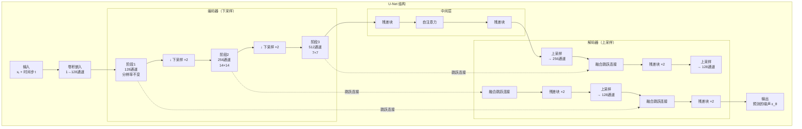
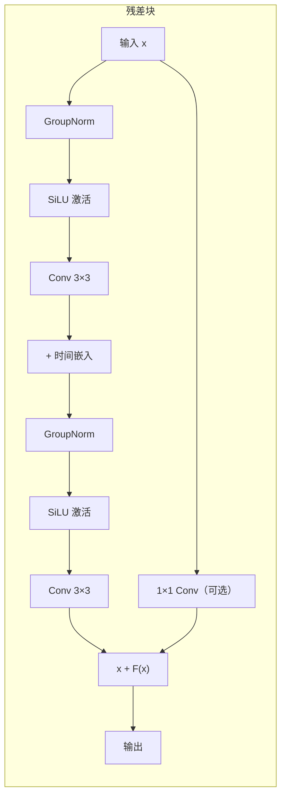

# U-Net 架构

> **一句话总结**：U-Net 是扩散模型中最常用的骨干网络，形状像字母"U"——先下采样压缩特征，再上采样恢复原始尺寸，中间有跳跃连接保住细节。

## 为什么扩散模型用 U-Net？

扩散模型需要一个网络来**预测噪声** $\epsilon_\theta(x_t, t)$。这个网络的输入输出都是图像，所以要求：

1. **输入输出尺寸相同**：输入 $x_t$ 是 $C \times H \times W$，输出也必须是 $C \times H \times W$
2. **能感知全局信息**：只看局部像素不够，网络需要理解整张图的结构
3. **需要时间信息**：网络要"知道"当前是第几步去噪

U-Net 完美满足这三点。

## U-Net 结构总览



### 三个组成部分

### 1. 编码器（Encoder）— 下采样路径

编码器逐步降低图像的空间分辨率（H, W 减半），增加通道数（C 翻倍）。

```
输入:  1×28×28
        ↓ 卷积
      128×28×28
        ↓ 残差块 ×2 + 下采样
      256×14×14
        ↓ 残差块 ×2 + 下采样
      512×7×7    ← 最底层
```

> **大白话**：编码器的作用是"压缩和理解"——把图像压缩成紧凑的特征表示。分辨率越低，网络视野越大，看到的信息越全局。

### 2. 中间层（Bottleneck）

最底层，空间分辨率最小（7×7），通道数最大（512）。

包含：
- **残差块 ×2**
- **自注意力层**：让每个像素关注所有其他像素，捕捉全局依赖
- 这也是**加时间嵌入**的地方

### 3. 解码器（Decoder）— 上采样路径

解码器逐步恢复图像分辨率，通道数递减，与编码器对称。

```
      512×7×7
        ↑ 残差块 + 跳跃连接 + 上采样
      256×14×14
        ↑ 残差块 + 跳跃连接 + 上采样
      128×28×28
        ↑ 输出卷积
输出:  1×28×28  ← 预测的噪声
```

### 关键设计：跳跃连接（Skip Connection）

解码器在每个分辨率层级都会**拼接**编码器对应层的输出：

> **大白话**：下采样时丢掉的细节信息（边缘、纹理），通过跳跃连接直接传给解码器。这样解码器既有全局理解（来自中间层），又有局部细节（来自跳跃连接）。

## 残差块（Residual Block）

U-Net 的每个阶段由残差块堆叠而成：



**时间嵌入融合**：时间嵌入 $t_{\text{emb}}$ 通过一个线性层映射，加到第一个卷积的输出上。

$$h' = h + \text{Linear}(\text{SiLU}(t_{\text{emb}}))$$

## 扩散模型中 U-Net 和传统 U-Net 的区别

| | 传统 U-Net（分割） | 扩散 U-Net（去噪） |
|---|---|---|
| 输入 | RGB 图像 | 噪声图 $x_t$ |
| 输出 | 分割掩码 | 预测的噪声 $\epsilon$ |
| 额外输入 | 无 | **时间步 $t$**（嵌入后注入每层） |
| 注意力 | 少数情况用 | **中间层标配** |
| 激活函数 | ReLU | **SiLU**（更平滑） |
| 归一化 | BatchNorm | **GroupNorm**（适合小批次） |

## 要点回顾

1. U-Net 是**编码器-解码器**结构，形状像字母 U
2. **下采样**提取全局特征，**上采样**恢复原始尺寸
3. **跳跃连接**在对应分辨率传递细节信息
4. 每个残差块都会**融合时间嵌入**，告诉网络现在是第几步
5. 中间层有**自注意力**，捕捉全局依赖
6. 输出和输入尺寸相同，内容为预测的噪声

---

**继续阅读**：[[08_时间嵌入与注意力机制]] — 时间嵌入和注意力具体是怎么工作的
