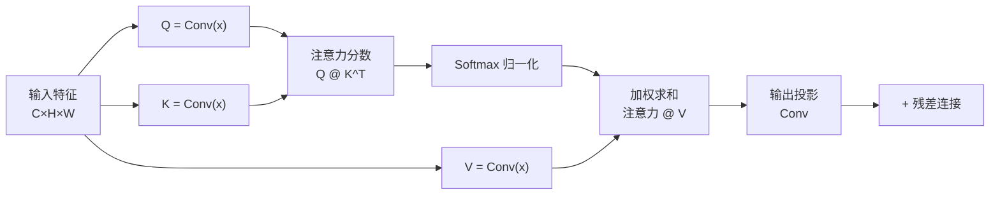

# 时间嵌入与注意力机制

> **一句话总结**：时间嵌入告诉 U-Net"现在去噪到第几步了"，注意力机制让网络在看一个像素时也"看到"其他像素。两者都是提升生成质量的关键组件。

## 一、时间嵌入（Time Embedding）

### 为什么需要时间嵌入？

扩散模型中，同一个 U-Net 要处理 $t=0$ 到 $t=T-1$ 所有时间步的输入。

**问题**：$x_t$ 在 $t$ 较小时还保留很多图像信息，$t$ 较大时几乎是纯噪声——网络需要知道当前是哪种情况，才能采取不同的去噪策略。

**解决方案**：把时间步 $t$ 编码成一个向量，注入到网络的每一层。

> **大白话**：时间嵌入就像给网络一个"进度条"——告诉它当前去噪进行到哪一步了，让它知道该"用力"还是"轻柔"地去噪。

### 正弦位置编码（Sinusoidal Positional Encoding）

和 Transformer 中的位置编码是同一套设计：

$$
\begin{aligned}
\text{PE}(t, 2i) &= \sin\left(\frac{t}{10000^{2i/d}}\right) \\
\text{PE}(t, 2i+1) &= \cos\left(\frac{t}{10000^{2i/d}}\right)
\end{aligned}
$$

其中 $d$ 是嵌入维度，$i$ 是维度索引。

![[../images/time_embedding.png]]

> **大白话**：用不同频率的正弦/余弦函数来编码 $t$ 的值。低频部分编码"大局"信息（在去噪的早期还是晚期），高频部分编码"精确"信息（具体第几步）。

**为什么用正弦/余弦？**

1. **连续性**：相邻的时间步产生相似的嵌入（$t=100$ 和 $t=101$ 很接近）
2. **有界性**：所有值都在 $[-1, 1]$ 之间，数值稳定
3. **无需学习**：是固定的编码，不需要训练

### 时间嵌入的注入方式

```
t（标量，比如 t=500）
    ↓
正弦编码 → [sin(500/10000⁰), cos(...), ...]  （维度: d=256）
    ↓
MLP 映射 → Linear → SiLU → Linear           （维度: 256→1024→256）
    ↓
加到每个残差块的中间特征上
```

在我们的代码中：

```python
# 时间嵌入网络
self.time_embed = nn.Sequential(
    SinusoidalTimeEmbedding(dim=256),
    nn.Linear(256, 1024),
    nn.SiLU(),
    nn.Linear(1024, 256),
)
```

在每个残差块中融合时间信息：

```python
# 时间信息通过线性层映射到特征通道数
time_scale = self.time_mlp(t_emb)  # [B, out_ch]
time_scale = time_scale[:, :, None, None]  # [B, out_ch, 1, 1]
h = h + time_scale  # 加到特征图上
```

## 二、注意力机制（Attention Mechanism）

### 为什么需要注意力？

卷积操作的**感受野是局部的**——一个 3×3 卷积只能看到周围 8 个像素。

对于生成任务，网络需要理解**全局结构**——一个数字"8"的上半圆和下半圆应该怎么对齐，一个字母"A"的左右两笔应该对称。

注意力机制让每个像素能"关注"到所有其他像素。

### 自注意力（Self-Attention）

和 Transformer 中的自注意力一样：



三个关键矩阵：
- **Q（Query）**：当前像素"想关注什么"
- **K（Key）**：其他像素"有什么信息"  
- **V（Value）**：其他像素"实际内容是什么"

> **大白话**：
> - Q 在问："我想知道远处那个像素是什么？"
> - K 在回答："我这里有这些信息"
> - 计算 Q 和 K 的相似度（注意力分数）
> - 用注意力分数对 V 加权求和
> - 结果：每个像素都获得了全局信息

### 多头注意力（Multi-Head Attention）

把特征分成多个"头"，每个头独立做注意力，然后合并：

```python
# 多头注意力
q = q.view(B, num_heads, head_dim, H*W)  # 分成多个头
k = k.view(B, num_heads, head_dim, H*W)
v = v.view(B, num_heads, head_dim, H*W)

attn = q @ k.transpose(-2, -1) * scale  # 每个头独立算注意力
attn = attn.softmax(dim=-1)

out = attn @ v  # 加权求和
out = out.reshape(B, C, H, W)  # 合并头
```

每个头可以关注不同类型的特征（一个头关注纹理，另一个头关注形状）。

### 在 U-Net 中的位置

注意力只放在**中间层**（最低分辨率 7×7），原因：

1. **计算成本**：注意力的计算复杂度是 $O(H^2W^2)$，放在大分辨率上太贵了
2. **全局性需求**：低分辨率特征图已经足够抽象，适合做全局交互
3. **最高层通道最多**：有足够的表达力做注意力

> **大白话**：在低分辨率（7×7）做注意力，只需要看 49 个位置，计算量小。在 28×28 能做，但需要看 784 个位置，慢了 256 倍。

## 两者的配合关系

```
x_t（噪声图） +  t（时间步）
        │
        ▼
    ┌──────────┐
    │ 残差块    │ ← 时间嵌入在这里注入
    │ + (Time)  │    告诉网络当前去噪阶段
    └────┬─────┘
         ▼
    ┌──────────┐
    │ 自注意力  │ ← 只在中间层
    │ (Attn)   │    让像素互相通信
    └────┬─────┘
         ▼
    ┌──────────┐
    │ 残差块    │
    │ + (Time) │
    └────┬─────┘
         ▼
   预测的噪声 ε_θ
```

## 要点回顾

1. **时间嵌入**用正弦/余弦编码告诉网络当前去噪步数
2. 时间嵌入通过 MLP 映射后，**加**到每个残差块的中间特征上
3. **自注意力**让每个像素关注所有其他像素，捕捉全局依赖
4. 注意力只在 U-Net 的**最底层**使用，平衡效果和计算成本
5. 时间嵌入 + 注意力是扩散模型的两个关键能力：**知道在哪一步 + 看到全局信息**

---

**继续阅读**：[[../第四部分：动手实现/09_项目结构与噪声调度器]] — 开始动手写代码了！
