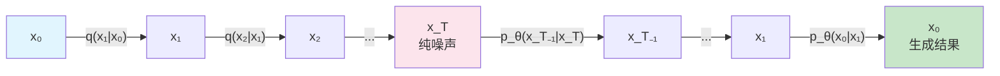

# 数学预备：高斯分布与马尔可夫链

> **一句话总结**：理解扩散模型只需要两个核心数学概念——高斯分布（描述噪声的数学工具）和马尔可夫链（描述过程的框架）。本章复习这两个概念，同时介绍重参数化技巧。

## 一、高斯分布（正态分布）—— 噪声的数学描述

### 什么是高斯分布

高斯分布（Gaussian Distribution），也叫正态分布（Normal Distribution），是自然界中最常见的概率分布。在扩散模型中，我们用高斯分布来描述"噪声"。

$$x \sim \mathcal{N}(\mu, \sigma^2)$$

> **大白话**：一个随机变量 $x$ 服从均值为 $\mu$、方差为 $\sigma^2$ 的高斯分布。

### 单变量高斯分布

只有一个变量时：

$$p(x) = \frac{1}{\sqrt{2\pi\sigma^2}} \exp\left(-\frac{(x-\mu)^2}{2\sigma^2}\right)$$

- $\mu$ = **均值**，决定分布的中心位置
- $\sigma^2$ = **方差**，决定分布的"宽度"（分散程度）
- $\sigma$ = **标准差**，$\sqrt{\sigma^2}$

> **大白话**：均值决定"在哪儿"，方差决定"有多散"。

### 多变量高斯分布

扩散模型处理的是图像（多个像素），所以需要多变量版本：

$$p(\mathbf{x}) = \frac{1}{\sqrt{(2\pi)^n |\Sigma|}} \exp\left(-\frac{1}{2}(\mathbf{x}-\boldsymbol{\mu})^\mathsf{T}\Sigma^{-1}(\mathbf{x}-\boldsymbol{\mu})\right)$$

在扩散模型中，我们通常假设每个像素独立加上方差相同的噪声，所以协方差矩阵是对角矩阵：$\Sigma = \sigma^2 \mathbf{I}$。

### 标准正态分布

当 $\mu = 0, \sigma^2 = 1$ 时：

$$\epsilon \sim \mathcal{N}(0, \mathbf{I})$$

这是扩散模型最终的目标分布——纯噪声。

## 二、马尔可夫链 —— "每一步只跟上一步有关"

### 什么是马尔可夫链

马尔可夫链（Markov Chain）是一个随机过程，它的核心性质是：

$$p(x_t | x_{t-1}, x_{t-2}, ..., x_0) = p(x_t | x_{t-1})$$

> **大白话**：预测下一步的状态，只依赖当前步的状态，不依赖更早的历史。就像一个"健忘"的过程——它只记得上一步发生了什么。

### 扩散模型中的马尔可夫链

扩散模型的前向和反向过程都是马尔可夫链：

**前向**：
$$q(x_{1:T} | x_0) = \prod_{t=1}^T q(x_t | x_{t-1})$$

> **大白话**：整个加噪过程的联合概率 = 每一步条件概率的乘积。因为每一步加噪只依赖上一步的结果。

**反向**：
$$p_\theta(x_{0:T}) = p(x_T) \prod_{t=1}^T p_\theta(x_{t-1} | x_t)$$

> **大白话**：整个生成过程的联合概率 = 从纯噪声开始 × 每一步去噪条件概率的乘积。

### 为什么用马尔可夫链？

1. **计算简单**：T 步的联合分布可以分解为 T 个条件概率的乘积
2. **训练高效**：每一步的网络输入只需要 $x_t$ 和 $t$，不需要记住历史
3. **灵活可控**：T 越大，加噪越平滑，生成质量越高

## 三、重参数化技巧 —— 把随机性抽出来

### 为什么要重参数化？

在扩散模型中，从前向过程的公式：
$$x_t = \sqrt{\bar\alpha_t} \cdot x_0 + \sqrt{1-\bar\alpha_t} \cdot \epsilon, \quad \epsilon \sim \mathcal{N}(0, \mathbf{I})$$

这实际上等价于从 $q(x_t | x_0) = \mathcal{N}(\sqrt{\bar\alpha_t} \cdot x_0, (1-\bar\alpha_t)\mathbf{I})$ 中采样。

问题在于，"采样"这个操作是**不可导**的。如果直接写 $x_t \sim \mathcal{N}(\sqrt{\bar\alpha_t} \cdot x_0, (1-\bar\alpha_t)\mathbf{I})$，梯度无法通过采样节点传播。

### 重参数化的做法

把采样过程拆成两个部分：

$$x_t = \mu + \sigma \cdot \epsilon, \quad \epsilon \sim \mathcal{N}(0, \mathbf{I})$$

1. **确定性部分** $\mu$ 和 $\sigma$：由网络参数决定，可以求导
2. **随机性部分** $\epsilon$：外部输入的随机噪声，不参与求导

![[../images/reparameterization_trick.png]]

> **大白话**：以前采样是一条链全都不可导。现在把采样的"随机性"抽出来变成外部噪声，网络只负责学均值和方差——梯度就能正常传播了。

### 在扩散模型中的应用

前向加噪：
$$x_t = \underbrace{\sqrt{\bar\alpha_t}}_{\text{可导}} x_0 + \underbrace{\sqrt{1-\bar\alpha_t}}_{\text{可导}} \cdot \underbrace{\epsilon}_{\text{外部噪声，不参与求导}}$$

这样我们能在损失函数中直接对 $\bar\alpha_t$ 求导，尽管 $x_t$ 本身是随机的。

## 四、必备符号对照表

| 符号 | 含义 | 大白话 |
|---|---|---|
| $x_0$ | 原始图像 | 训练数据里那张干净的图 |
| $x_t$ | 第 $t$ 步的图像 | 加噪 $t$ 步后的图 |
| $x_T$ | 纯噪声 | 最后一步，完全随机 |
| $T$ | 总步数 | 一般取 1000 |
| $q$ | 前向分布 | 加噪过程的概率描述 |
| $p_\theta$ | 反向分布 | 去噪过程的概率描述 |
| $\beta_t$ | 第 $t$ 步的噪声方差 | 每一步加多少噪声 |
| $\bar\alpha_t$ | 累积信号保留率 | 原始信息还剩多少 |
| $\epsilon$ | 高斯噪声 | $\mathcal{N}(0, \mathbf{I})$ |
| $\theta$ | 网络参数 | 神经网络要学的权重 |

## 要点回顾

1. **高斯分布**：用 $\mu$ 和 $\sigma^2$ 描述的噪声分布
2. **马尔可夫链**：每一步只依赖前一步，使计算可分解
3. **重参数化技巧**：把采样拆成"可导的均值/方差"+"外部噪声"，让梯度能传播
4. 扩散模型里这三个概念是**嵌套**使用的：马尔可夫链定义过程、高斯分布描述每一步的噪声、重参数化让训练可行

---

**继续阅读**：[[05_变分下界_ELBO]] — 扩散模型训练的核心目标函数
