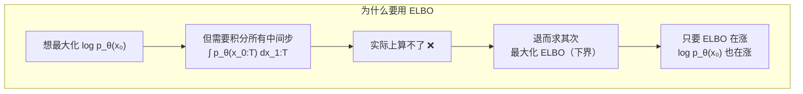
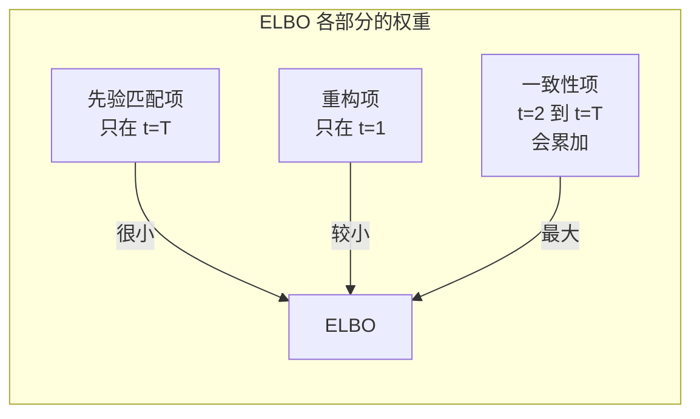

# 变分下界 ELBO

> **一句话总结**：ELBO（Evidence Lower Bound）是扩散模型训练时真正要优化的目标函数。它解决了一个核心问题——我们没法直接计算"生成图像的概率"，所以退而求其次，最大化一个下界。

## 核心问题：为什么不能直接最大化似然？

扩散模型的目标是学习一个分布 $p_\theta(x)$，让它尽可能接近真实数据分布 $q(x)$。

理想情况下，我们希望**最大化生成模型在训练数据上的对数似然**：

$$\max_\theta \mathbb{E}_{x_0 \sim q(x_0)} \left[\log p_\theta(x_0)\right]$$

但是！$p_\theta(x_0)$ 本身是一个复杂的边缘分布：

$$p_\theta(x_0) = \int p_\theta(x_{0:T}) dx_{1:T}$$

> **大白话**：要知道一张图 $x_0$ 的生成概率，需要对所有可能的中间状态 $x_{1:T}$ 做积分——这个积分没法算，因为状态空间太大了（$T=1000$，每步一张 $28 \times 28$ 的图）。

## ELBO 的引入

既然直接计算 $\log p_\theta(x_0)$ 不可行，我们转而计算一个**下界**：

$$\log p_\theta(x_0) \geq \mathbb{E}_{q(x_{1:T} | x_0)} \left[ \log \frac{p_\theta(x_{0:T})}{q(x_{1:T} | x_0)} \right] = \text{ELBO}$$

> **大白话**：ELBO 是 $\log p_\theta(x_0)$ 的下界。最大化 ELBO 就等价于在让 $p_\theta$ 更接近真实分布。

### 从 KL 散度理解

ELBO 也可以从 KL 散度来理解。KL 散度衡量两个分布的差异：

$$D_{KL}(q(x_{1:T} | x_0) \parallel p_\theta(x_{1:T} | x_0)) \geq 0$$

展开后得到：

$$\log p_\theta(x_0) = \text{ELBO} + D_{KL}(q(x_{1:T} | x_0) \parallel p_\theta(x_{1:T} | x_0))$$

> **大白话**：$\log p_\theta(x_0)$ 等于 ELBO 加上一个非负的 KL 散度。KL 散度衡量的正是"前向过程 $q$ 的后验分布"和"反向过程 $p_\theta$"之间的差距。

## ELBO 的展开形式

ELBO 可以展开成一个便于计算的形式：

$$\text{ELBO} = \underbrace{\mathbb{E}_{q(x_1|x_0)}\left[\log p_\theta(x_0|x_1)\right]}_{\text{重构项}} - \underbrace{\sum_{t=2}^T \mathbb{E}_{q(x_t|x_0)}\left[D_{KL}(q(x_{t-1}|x_t, x_0) \parallel p_\theta(x_{t-1}|x_t))\right]}_{\text{一致性项}} - \underbrace{D_{KL}(q(x_T|x_0) \parallel p(x_T))}_{\text{先验匹配项}}$$

> **大白话**：ELBO 分为三项：
>
> 1. **重构项**：网络从 $x_1$ 恢复 $x_0$ 的能力——最后生成的图还得像原图
> 2. **一致性项**（关键）：让网络学习每一反向步的分布，和真实的（已知 $x_0$ 条件下的）后验分布对齐
> 3. **先验匹配项**：最终 $x_T$ 是否真的接近标准高斯分布——确保最后一步只剩噪声

### 为什么一致性项最重要？

- **重构项**只涉及最后一步（$t=1$），相对简单
- **先验匹配项**基本上已经由前向过程保证了（线性调度下 $x_T$ 几乎就是 $\mathcal{N}(0, \mathbf{I})$）
- **一致性项**涵盖了 $t=2$ 到 $t=T$ 的所有步，是训练的主要工作

## 要点回顾

1. $\log p_\theta(x_0)$ 没法直接算，所以用 **ELBO** 代替
2. ELBO 是 $\log p_\theta(x_0)$ 的下界，最大化它等价于让 $p_\theta$ 接近真实分布
3. ELBO 可以展开为：重构项 + 一致性项 + 先验匹配项
4. **一致性项**是训练的主要目标，覆盖了几乎所有时间步
5. 下一章我们会看到，一致性项最终可以**简化成 MSE 损失**——这就是 DDPM 的精妙之处

---

**继续阅读**：[[06_核心推导_从ELBO到MSE]] — 看 ELBO 如何一步步变成简单的 MSE 损失
