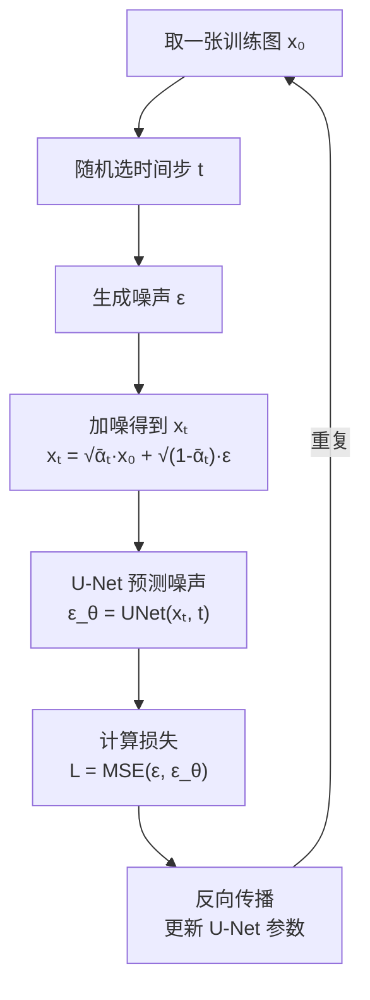

# 核心推导：从 ELBO 到 MSE

> **一句话总结**：上一章我们得到了 ELBO，这一章我们一步步把 ELBO 化简成最终训练用的 MSE 损失——这也是 DDPM 论文（Denoising Diffusion Probabilistic Models）的核心贡献。

## 推导路线图

```
ELBO（变分下界）
    ↓ 代入前向/反向分布的表达式
KL 散度的具体形式
    ↓ 高斯分布的 KL 散度有闭式解
期望 → 简化为预测误差
    ↓
MSE 损失（最终训练目标）
```

## 第一步：ELBO 中的一致性项

回顾一下，一致性项是：

$$\sum_{t=2}^T \mathbb{E}_{q(x_t|x_0)}\left[D_{KL}\big(q(x_{t-1}|x_t, x_0) \parallel p_\theta(x_{t-1}|x_t)\big)\right]$$

它比较两个分布：

1. **前向过程的后验** $q(x_{t-1}|x_t, x_0)$ — 已知 $x_t$ 和 $x_0$ 时 $x_{t-1}$ 的"真实"分布
2. **反向过程的预测** $p_\theta(x_{t-1}|x_t)$ — 网络预测的 $x_{t-1}$ 分布

两种分布都是高斯分布，因此 KL 散度有闭式解。

## 第二步：前向过程的后验分布

已知 $x_t$ 和 $x_0$，$x_{t-1}$ 的分布是什么？可以用贝叶斯公式推导：

$$q(x_{t-1} | x_t, x_0) = \mathcal{N}(x_{t-1}; \tilde\mu_t(x_t, x_0), \tilde\beta_t \mathbf{I})$$

其中：
- 均值：$$\tilde\mu_t(x_t, x_0) = \frac{\sqrt{\alpha_t}(1-\bar\alpha_{t-1})}{1-\bar\alpha_t} x_t + \frac{\sqrt{\bar\alpha_{t-1}}\beta_t}{1-\bar\alpha_t} x_0$$

- 方差：$$\tilde\beta_t = \frac{1-\bar\alpha_{t-1}}{1-\bar\alpha_t} \beta_t$$

> **大白话**：如果知道原始图 $x_0$，那 $x_{t-1}$ 的分布可以用公式精确算出来。均值是 $x_t$ 和 $x_0$ 的加权平均，方差与 $\beta_t$ 有关。

## 第三步：反向过程的预测分布

反向过程用神经网络近似后验：

$$p_\theta(x_{t-1} | x_t) = \mathcal{N}(x_{t-1}; \mu_\theta(x_t, t), \Sigma_\theta(x_t, t))$$

DDPM 中做了两个简化：
1. **方差固定**：$\Sigma_\theta(x_t, t) = \tilde\beta_t \mathbf{I}$（不学习方差）
2. **预测噪声**：均值也用噪声来表示

$$\mu_\theta(x_t, t) = \frac{1}{\sqrt{\alpha_t}} \left(x_t - \frac{\beta_t}{\sqrt{1-\bar\alpha_t}} \epsilon_\theta(x_t, t)\right)$$

## 第四步：KL 散度的化简

两个高斯分布之间的 KL 散度有公式：

$$D_{KL}(\mathcal{N}(\tilde\mu, \tilde\sigma^2) \parallel \mathcal{N}(\mu_\theta, \sigma^2)) = \frac{\|\tilde\mu - \mu_\theta\|^2}{2\sigma^2} + \text{（常数项）}$$

把 $\tilde\mu_t$ 和 $\mu_\theta$ 的表达式代入并化简：

$$\|\tilde\mu_t - \mu_\theta(x_t, t)\|^2 = \left\|\frac{1}{\sqrt{\alpha_t}}\left(x_t - \frac{\beta_t}{\sqrt{1-\bar\alpha_t}}\epsilon\right) - \frac{1}{\sqrt{\alpha_t}}\left(x_t - \frac{\beta_t}{\sqrt{1-\bar\alpha_t}}\epsilon_\theta(x_t, t)\right)\right\|^2$$

### 关键化简

化简后，多数项消掉了：

$$= \frac{\beta_t^2}{\alpha_t(1-\bar\alpha_t)} \left\|\epsilon - \epsilon_\theta(x_t, t)\right\|^2$$

忽略前面的系数（DDPM 发现简单版本效果更好），我们得到最终损失：

## 第五步：简化的 MSE 损失

$$\boxed{L_{\text{simple}} = \mathbb{E}_{t, x_0, \epsilon} \left[ \left\| \epsilon - \epsilon_\theta(x_t, t) \right\|^2 \right]}$$

> **大白话**：训练目标 = 让网络预测的噪声 $\epsilon_\theta(x_t, t)$ 尽可能接近真实加入的噪声 $\epsilon$。

## 完整的训练算法

```
对每个训练步骤：
1. 从训练集取一张图 x₀
2. 随机选一个时间步 t ∈ [0, T-1]
3. 生成高斯噪声 ε ~ N(0, I)
4. 计算加噪后的图：x_t = √ᾱ_t · x₀ + √(1-ᾱ_t) · ε
5. 网络预测噪声：ε_θ = U-Net(x_t, t)
6. 计算损失：L = MSE(ε, ε_θ)
7. 反向传播更新网络参数
```



## 完整的采样算法

```
1. x_T ~ N(0, I)    ← 从纯噪声开始
2. for t = T, T-1, ..., 1:
     a. 如果是 t=0，设 z=0；否则 z ~ N(0, I)
     b. x_{t-1} = 1/√α_t · (x_t - β_t/√(1-ᾱ_t) · ε_θ(x_t, t)) + √β_t · z
3. 返回 x₀
```

## 训练 vs 采样的核心对比

| | 训练 | 采样（生成） |
|---|---|---|
| 需要网络 | ✅ U-Net 预测噪声 | ✅ 同一个 U-Net |
| 需要数据 | ✅ 需要训练图像 | ❌ 不需要，从噪声开始 |
| 步数 | 每一步独立，随机选 t | 必须从 T 走到 0 |
| 速度 | 快（一步就完） | 慢（T 步） |
| 损失 | MSE 损失 | 无（已训练完） |

## 要点回顾

1. ELBO 中的 KL 散度项，代入高斯分布表达式后可以化简
2. 关键技巧：**网络预测噪声 $\epsilon$** 而不是直接预测图像或均值
3. 最终化简为简单的 **MSE 损失**
4. 训练时每步只需：随机选 $t$ → 加噪 → 预测噪声 → MSE 损失
5. 采样时必须走完所有 T 步，从噪声逐步去噪到图像

---

**至此，扩散模型的核心数学推导完成！** 下一章我们进入模型架构部分。

**继续阅读**：[[../第三部分：模型架构/07_U_Net架构]]
