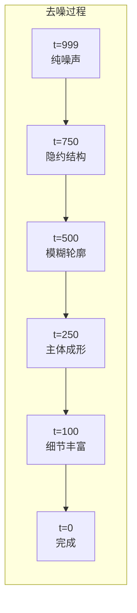

# 生成效果可视化

> **一句话总结**：训练好模型后，我们来可视化"去噪过程"——从纯噪声到清晰数字的每一帧，让你亲眼看到扩散模型是怎么"变魔术"的。

## 可视化去噪过程

### 核心问题

采样时，从 $x_T$（纯噪声）到 $x_0$（清晰图像）要走 T=1000 步。这 1000 步中发生了什么？每一步图像长什么样？

我们的 `sample()` 函数支持 `return_all_steps=True` 参数，返回每一步的中间结果：

```python
# 获取所有中间步骤
all_steps = pipeline.sample(batch_size=4, return_all_steps=True)
# all_steps.shape = [T+1, 4, 1, 28, 28]
```

### 选取关键时间步

1000 步太多了，我们选取几个关键时刻：

| 时间步 | 图像状态 | 说明 |
|---|---|---|
| $t=999$ | 纯噪声 | 起点，什么都看不到 |
| $t=800$ | 隐约有结构 | 数字的"幽灵"开始出现 |
| $t=600$ | 模糊轮廓 | 能看出大概形状了 |
| $t=400$ | 主体可见 | 数字的主要部分浮现出来 |
| $t=200$ | 细节增加 | 边缘锐化，笔画变得清晰 |
| $t=50$ | 几乎完成 | 只剩一点点模糊 |
| $t=0$ | 最终结果 | 清晰地数字 |

### 观察到的现象

去噪过程遵循一个有趣的模式：

1. **早期（$t=999 \to 700$）**：噪声中**突然**出现模糊的结构——不是渐变，是"浮现"
2. **中期（$t=700 \to 300$）**：数字的**粗轮廓**形成，看起来像低分辨率版本
3. **晚期（$t=300 \to 100$）**：**细节**逐步补全，边缘锐化
4. **最后（$t=100 \to 0$）**：**精修**阶段，稍微调整笔画的粗细和位置



> **大白话**：扩散模型的生成过程不是"逐步画出来的"，而是"从噪声中浮现出来的"。早期先确定大概结构，中期填入主要内容，后期精修细节。

## 对比不同时间步的生成质量

可以用 `sample_and_visualize.py` 生成一个 8×关键步数的网格图：

```bash
python sample_and_visualize.py --checkpoint output/diffusion_model_final.pt
```

这会在 `output/` 目录下生成：
- `denoising_process.png` — 去噪过程可视化（从上到下：噪声 → 清晰）
- `forward_process_vis.png` — 加噪过程（从上到下：清晰 → 噪声）

## 生成 GIF 动图

如果想看动态效果，可以用 `--gif` 参数：

```bash
python sample_and_visualize.py --checkpoint output/diffusion_model_final.pt --gif
```

这会生成 `output/denoising_process.gif`，展示从纯噪声到清晰数字的完整过程。

## 可视化采样过程中的不确定性

扩散模型的生成是**概率性的**——每次从同一个噪声起点出发，走不同的随机中间步，会得到不同的结果。

你可以通过固定随机种子来重现：

```python
# 固定种子，得到可复现的结果
torch.manual_seed(42)
samples_1 = pipeline.sample(batch_size=4)

torch.manual_seed(42)  # 同样的种子
samples_2 = pipeline.sample(batch_size=4)  # 和 samples_1 一模一样

torch.manual_seed(999)  # 不同种子
samples_3 = pipeline.sample(batch_size=4)  # 完全不同的结果
```

## 预期结果参考

50 轮训练后的生成效果：

```
期望效果：
- 大部分数字清晰可辨（5-9 分）
- 少数数字边缘略微模糊（3-4 分）
- 极少数字无法辨认（1-2 分）

问题诊断：
- 所有数字都模糊 → 训练轮数不够，继续训练
- 出现全黑/全白 → 模型或数据有问题
- 所有数字一样 → 模式坍塌（扩散模型很少见）
```

## 对比前向和反向过程

有趣的是，**前向加噪和反向去噪是对称的**：

| 时间步 | 前向（加噪） | 反向（去噪） |
|---|---|---|
| t=0 | 清晰图像 | 生成结果 |
| t=250 | 稍微有点噪点 | 已经很清晰 |
| t=500 | 模糊但仍可辨认 | 大致轮廓可见 |
| t=750 | 几乎看不出数字 | 开始出现结构 |
| t=999 | 纯噪声 | 你输入的纯噪声 |

## 要点回顾

1. 去噪过程是**从噪声中浮现**，不是逐步绘制
2. 早期**确定结构**，中期**填充内容**，后期**精修细节**
3. 使用 `return_all_steps=True` 获取完整去噪过程
4. 生成 **GIF** 可以看到动态效果
5. 固定随机种子可以**复现**生成结果

---

**继续阅读**：[[15_超参数探索]]
