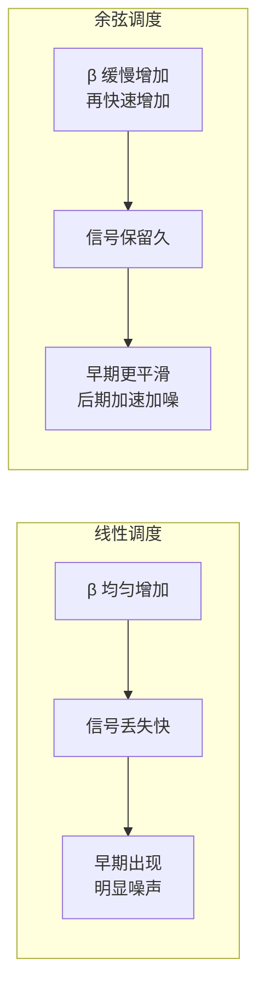

# 超参数探索

> **一句话总结**：扩散模型有几个关键超参数值得调优——扩散步数 T、噪声调度方式、学习率、批次大小等。本章带你做几个对比实验。

## 实验一：扩散步数 T 的影响

T 是扩散模型最重要的超参数。T 越大，每一步加噪越少，去噪过程越平滑，但训练和采样也越慢。

### 实验设置

```bash
# T=500 版本
python train_mnist.py --T 500  --save_dir output_T500 --epochs 50

# T=1000 版本（默认）
python train_mnist.py --T 1000 --save_dir output_T1000 --epochs 50

# T=200 版本（快速实验）
python train_mnist.py --T 200  --save_dir output_T200 --epochs 50
```

### 预期结果

| T | 训练时间 | 采样时间 | 生成质量 |
|---|---|---|---|
| 200 | 最快（~10 分钟） | 0.2 秒 | 较差，数字边缘粗糙 |
| 500 | 中等（~25 分钟） | 0.5 秒 | 较好，大部分数字清晰 |
| 1000 | 最慢（~45 分钟） | 1 秒 | 最好，细节丰富 |

### 分析

- T 太小（<200）：每一步都要去掉很多噪声，网络学不过来——生成质量差
- T 适中（500-1000）：每一步只需去掉一点点噪声，每个步的去噪任务都简单——效果好
- T 太大（>2000）：边际收益递减，训练太慢

> **大白话**：就像把一大块冰切成冰块——一次切太多（T 小）容易碎，一次切一点点（T 大）但太费时间。500-1000 是一个合理的中间值。

## 实验二：线性调度 vs 余弦调度

### 实验设置

```bash
# 线性调度（默认）
python train_mnist.py --schedule linear --save_dir output_linear --epochs 50

# 余弦调度
python train_mnist.py --schedule cosine --save_dir output_cosine --epochs 50
```

### 理论区别



| 调度 | 早期（t < 200） | 中期（200 < t < 800） | 后期（t > 800） |
|---|---|---|---|
| 线性 | 加噪平稳 | 噪声主导 | 纯噪声 |
| 余弦 | 图像保留好 | 噪声缓慢增加 | 快速过渡到纯噪声 |

### 预期结果

- **余弦调度**通常在**采样步数较少**时表现更好
- **线性调度**在**T=1000 标准设置**下效果已经很不错
- 余弦调度的 $\bar\alpha_t$ 衰减更慢，早期保留更多信息

## 实验三：学习率的影响

```bash
# 不同学习率
python train_mnist.py --lr 1e-3 --save_dir output_lr1e-3 --epochs 50
python train_mnist.py --lr 5e-4 --save_dir output_lr5e-4 --epochs 50
python train_mnist.py --lr 1e-4 --save_dir output_lr1e-4 --epochs 50
```

### 观察方法

对比三个实验的 **损失曲线** 和 **最终生成样本**：

```
损失曲线对比（横轴：训练步数，纵轴：损失）

lr=1e-3  ── 快速下降，可能有点震荡，最终损失低
lr=5e-4  ── 稳定下降，没有震荡，最终损失稍高  
lr=1e-4  ── 下降太慢，50 轮内可能还没收敛
```

**建议**：
- 默认 1e-3 在 MNIST 上表现不错
- 如果训练震荡 → 降低学习率到 5e-4
- 如果损失下降太慢 → 可能可以增大学习率

## 实验四：加快采样的尝试

### 减少采样步数

DDPM 训练时用 T=1000，但采样时可以走少几步：

```python
# 修改 sample 的循环次数，只走部分步
sampling_steps = 100  # 只用 100 步
step_skip = T // sampling_steps
timesteps = list(range(T - 1, -1, -step_skip))
```

这样采样速度快 10 倍，但质量会下降。

**实验**：对比 100 步采样和 1000 步采样的生成结果：

| 采样步数 | 速度 | 质量 |
|---|---|---|
| 1000 步 | 1 倍 | 最佳 |
| 200 步 | 5 倍 | 稍微变差 |
| 50 步 | 20 倍 | 明显变差 |

## 实验记录模板

建议用电子表格记录实验： 

| 实验 | T | Schedule | lr | Epochs | 最终损失 | 生成质量 | 训练时间 |
|---|---|---|---|---|---|---|---|
| 1 | 500 | linear | 1e-3 | 50 | 0.025 | 较好 | 25 min |
| 2 | 1000 | linear | 1e-3 | 50 | 0.018 | 最好 | 45 min |
| 3 | 1000 | cosine | 1e-3 | 50 | 0.020 | 好 | 45 min |
| 4 | 1000 | linear | 5e-4 | 50 | 0.022 | 好 | 45 min |

## 要点回顾

1. **T=500~1000** 是扩散步数的最佳范围
2. **余弦调度**在采样步数少时表现更好
3. **学习率** 1e-3 是好的起点
4. 采样时可以**减少步数**来加速，但会损失质量
5. 建议做**实验记录**，方便对比不同配置

---

**继续阅读**：[[../第六部分：进阶/16_条件扩散模型]]
