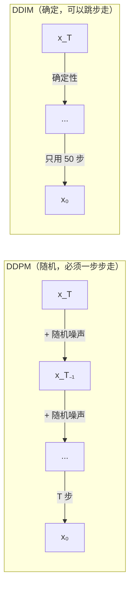

# DDIM 加速采样

> **一句话总结**：DDPM 采样要走 1000 步，太慢了。DDIM（Denoising Diffusion Implicit Models）通过把采样过程变成**确定性**的，只用 50 步就能达到接近 1000 步的效果。

## 为什么 DDPM 采样慢？

DDPM 采样的每一步都要：

1. 用 U-Net 预测噪声（前向传播）
2. 根据预测计算 $x_{t-1}$ 的均值
3. 加上随机噪声

U-Net 的前向传播耗时 ≈ 1 毫秒 × 1000 步 = **1 秒**（GPU 上）。

看起来不多？但在 512×512 的高清图上，U-Net 更大，前向传播需要 **~100 毫秒** × 1000 步 = **100 秒**（GPU）。

## DDIM 的核心思想

### 关键洞察

DDPM 的采样过程是一个**随机过程**——每一步都要加随机噪声。DDIM 发现：

> 如果把每一步的随机噪声去掉，采样就变成了**确定性的**。确定性的过程可以走"捷径"——直接从 $t$ 跳到 $t-\Delta$。



### 数学推导

DDIM 的更新公式：

$$x_{t-\Delta} = \sqrt{\bar\alpha_{t-\Delta}} \cdot \hat x_0(x_t) + \sqrt{1-\bar\alpha_{t-\Delta} - \sigma_t^2} \cdot \epsilon_\theta(x_t, t) + \sigma_t \cdot \epsilon_t$$

其中：
- $\hat x_0(x_t) = \frac{x_t - \sqrt{1-\bar\alpha_t} \cdot \epsilon_\theta(x_t, t)}{\sqrt{\bar\alpha_t}}$ — 从当前 $x_t$ 和预测噪声反推的 $\hat x_0$
- $\sigma_t$ 控制随机性

### 两种极端情况

| $\sigma_t$ | 模型类型 | 特点 |
|---|---|---|
| $\sigma_t = 0$ | **DDIM**（确定性） | 能走捷径，50 步即可 |
| $\sigma_t = \tilde\beta_t$ | **DDPM**（随机） | 和原版一样，必须按步走 |

> **大白话**：DDIM 在 $\sigma_t = 0$ 时变成了**确定性**的生成过程。因为现在是确定的，就可以大步跳过中间步骤。就像开车知道确切的路线，不必每个路口都停下来确认。

### DDIM 的另一个性质：可逆性

因为 DDIM 是确定性的，前向和反向过程是**可逆**的：

- **反向（生成）**：$x_T \to x_0$
- **前向（编码）**：$x_0 \to x_T$

这意味着你可以拿一张真实图片，让它沿着 DDIM 轨道向前到达噪声空间，再反向走回——得到**几乎和原图一样**的结果。这在图像编辑、图像插值等任务中很有用。

## DDIM 采样代码

```python
def sample_ddim(self, batch_size=16, ddim_steps=50, eta=0.0):
    """
    DDIM 采样
    
    参数：
        ddim_steps: 采样步数（默认 50，是 DDPM 1000 步的 20 倍加速）
        eta: 噪声系数，0=完全确定，1=和 DDPM 一样
    """
    # 计算跳步索引
    step_ratio = self.scheduler.T // ddim_steps
    timesteps = torch.linspace(T-1, 0, ddim_steps, device=device).long()
    
    x = torch.randn(shape, device=device)
    
    for t_step in timesteps:
        t = torch.full((batch_size,), t_step, device=device, dtype=torch.long)
        
        pred_noise = self.model(x, t)
        
        # 反推 x_0 的估计
        alpha_bar = self.scheduler.alpha_bars[t_step]
        pred_x0 = (x - torch.sqrt(1 - alpha_bar) * pred_noise) / torch.sqrt(alpha_bar)
        pred_x0 = torch.clamp(pred_x0, -1.0, 1.0)
        
        # DDIM 更新
        alpha_bar_prev = self.scheduler.alpha_bars[t_step - step_ratio]
        sigma = eta * torch.sqrt((1-alpha_bar_prev)/(1-alpha_bar)) * torch.sqrt(1 - alpha_bar/alpha_bar_prev)
        
        c1 = torch.sqrt(alpha_bar_prev)
        c2 = torch.sqrt(1 - alpha_bar_prev - sigma ** 2)
        
        x = c1 * pred_x0 + c2 * pred_noise + sigma * torch.randn_like(x)
    
    return x
```

## 实验：DDPM vs DDIM 对比

```bash
# 用训练好的模型跑 DDIM 采样
python -c "
from config import DiffusionConfig
from scheduler import NoiseScheduler
from model import UNet
from diffusion import DiffusionPipeline

config = DiffusionConfig()
scheduler = NoiseScheduler(T=1000)
model = UNet(config)
model.load_state_dict(torch.load('output/diffusion_model_final.pt'))
pipeline = DiffusionPipeline(model, scheduler, config)

# DDPM（1000 步）
ddpm_samples = pipeline.sample(batch_size=16)

# DDIM（50 步，确定性）
ddim_samples = pipeline.sample_ddim(batch_size=16, ddim_steps=50, eta=0.0)
"
```

### 预期结果

| 方法 | 步数 | 速度 | 质量 | 多样性 |
|---|---|---|---|---|
| DDPM | 1000 | 1x | 最好 | 高 |
| DDIM (eta=0) | 50 | **20x** | 接近最好 | 稍低（确定性的） |
| DDIM (eta=0) | 20 | **50x** | 可接受 | 低 |
| DDIM (eta=1) | 50 | 20x | 接近 DDPM | 高 |

### 关键发现

1. DDIM 在 **50 步**时质量接近 DDPM 的 1000 步——**20 倍加速**
2. $\eta=0$（确定性）生成质量略低于 DDPM，但**远快于** DDPM
3. $\eta > 0$ 增加随机性，可以提高多样性
4. 步数越少，质量下降越明显（但 DDIM 比同步数的 DDPM 好很多）

## 要点回顾

1. DDPM 采样**慢**，因为要走 T 步（如 1000 步）
2. DDIM 通过**去掉随机噪声**，使采样过程确定性化
3. 确定性过程**可以跳步**——只用 50 步就能达到接近 1000 步的效果
4. DDIM 的另一个优势是**可逆性**：支持真实图像的编码和解码
5. DDIM 是现代高效扩散模型（Stable Diffusion 等）的标配采样器

---

**继续阅读**：[[18_总结与阅读地图]]
