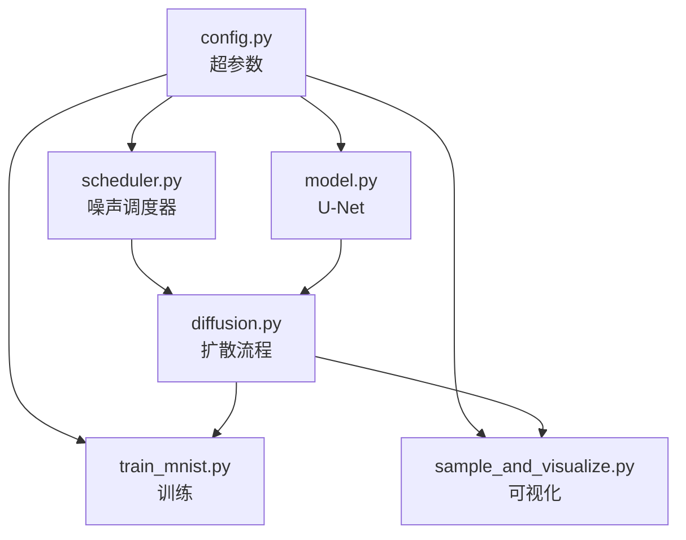

# 项目结构与噪声调度器

> **一句话总结**：本章开始动手写代码！先介绍项目结构，然后实现核心组件之一——噪声调度器（Scheduler）。

## 项目结构总览

```
diffusion/
├── code/                    ← 可运行的 Python 代码
│   ├── requirements.txt     ← 依赖（torch, torchvision, matplotlib 等）
│   ├── config.py            ← 所有超参数集中管理
│   ├── scheduler.py         ← 噪声调度器（beta 生成 + 前向加噪）
│   ├── model.py             ← U-Net 模型
│   ├── diffusion.py         ← 扩散流程（训练一步 + 采样）
│   ├── train_mnist.py       ← 训练主脚本
│   ├── sample_and_visualize.py  ← 采样 + 可视化
│   └── output/              ← 输出目录（模型权重 + 图片）
├── scripts/
│   └── gen_forward_diagram.py   ← 生成教程配图
├── images/                  ← 教程配图
├── 00_导读.md               ← 教程文章
└── 第一部分 ~ 第六部分/     ← 教程文章
```

### 各模块的依赖关系



## 配置类（config.py）

所有超参数集中放在一个配置类中：

```python
class DiffusionConfig:
    image_size     = 28     # MNIST 图像尺寸
    image_channels = 1      # 灰度图
    T = 1000                # 扩散总步数
    beta_start = 1e-4       # 起始噪声率
    beta_end   = 0.02       # 终止噪声率
    beta_schedule = "linear" # 调度方式
    base_channels = 128     # U-Net 基础通道数
    time_emb_dim = 256      # 时间嵌入维度
    epochs = 50             # 训练轮数
    batch_size = 128        # 批次大小
    lr = 1e-3              # 学习率
```

## 噪声调度器（scheduler.py）

噪声调度器是扩散模型的计算核心。它负责：

1. **生成 $\beta_t$ 调度**（线性 / 余弦）
2. **计算所有派生系数**：$\alpha_t$、$\bar\alpha_t$、后验方差
3. **提供前向加噪函数**：$q\text{\_sample}(x_0, t)$
4. **提供反向过程的系数**：用于采样生成

### 调度的可视化

![[../images/schedule_curves.png]]

**左图**：$\beta_t$（噪声率）随时间变化。线性调度均匀增加，余弦调度在后期增长更快。

**中图**：$\bar\alpha_t$（信号保留率）从 1 下降到接近 0。余弦调度在早期保留了更多信号。

**右图**：信噪比（SNR）的对数图。两个调度在高信噪比区域差异明显。

### 核心代码解读

```python
class NoiseScheduler:
    def __init__(self, T=1000, beta_start=1e-4, beta_end=0.02, schedule="linear"):
        # 1. 生成 beta 序列
        if schedule == "linear":
            self.betas = torch.linspace(beta_start, beta_end, T)
        elif schedule == "cosine":
            self.betas = self._cosine_schedule(T)
        
        # 2. 计算 alpha 系列系数
        self.alphas = 1.0 - self.betas                    # 信号保留率
        self.alpha_bars = torch.cumprod(self.alphas, dim=0)  # 累积保留率
```

### 最重要的函数：q_sample

```python
def q_sample(self, x_0, t, noise=None):
    """
    前向加噪：从 x_0 直接跳到 x_t
    
    公式：x_t = √ᾱ_t · x_0 + √(1-ᾱ_t) · ε
    """
    if noise is None:
        noise = torch.randn_like(x_0)
    
    sqrt_alpha_bar = self.alpha_bars[t].sqrt().view(-1, 1, 1, 1)
    sqrt_one_minus = (1 - self.alpha_bars[t]).sqrt().view(-1, 1, 1, 1)
    
    x_t = sqrt_alpha_bar * x_0 + sqrt_one_minus * noise
    
    return x_t, noise
```

`t` 是一个批量索引，每个样本可以有不同的时间步。`.view(-1, 1, 1, 1)` 将维度从 [B] 变成 [B, 1, 1, 1]，方便广播到 [B, C, H, W] 的图像。

## 运行这个模块

可以单独测试调度器：

```bash
cd code
python -c "
from scheduler import NoiseScheduler
s = NoiseScheduler(T=1000)
print('betas shape:', s.betas.shape)
print('alpha_bars[0]:', s.alpha_bars[0].item())
print('alpha_bars[999]:', s.alpha_bars[999].item())
"
```

输出类似：
```
betas shape: torch.Size([1000])
alpha_bars[0]: 0.9999
alpha_bars[999]: 0.0001
```

## 要点回顾

1. 项目采用**模块化设计**，每个组件独立文件
2. 配置类集中管理所有**超参数**
3. 调度器生成 $\beta$ 序列并计算所有系数
4. `q_sample` 实现**跳跃式前向加噪**，直接从 $x_0$ 到 $x_t$
5. 支持线性 / 余弦两种调度方式

---

**继续阅读**：[[10_前向加噪与数据集准备]]
